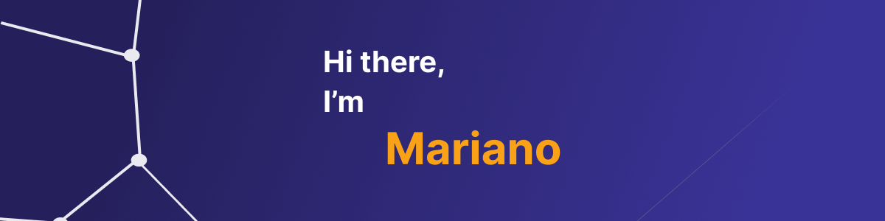

  

    
    
  

  ## 🧭 &nbsp;About Me

  - 📚 Software developer student at ISTEA.
  <!-- - 🔭 I'm currently working on <a href="#">MyJob</a> -->

  - 🌱  I’m studying **TypeScript**, **ReactJS**, **NodeJS** and **Python**.

  - ⚡ Fun fact: I'm a <a href="https://en.wikipedia.org/wiki/Potato">potato</a>

   
  

  `Developer IT enthusiast`
   

  `=========================`
   

  `¯\_(ツ)_/¯`

  ## 📚 &nbsp;Currently studying

  - MongoDb
  - Bootstrap
  - React
  - Kotlin

  ## 🛠️ &nbsp;My Tech Stacks

  &nbsp;
  &nbsp;
  
  &nbsp;
  &nbsp;

  &nbsp;
  
  
  

  &nbsp;
  
  
  &nbsp;
  
  
  
  

  ## 📊 &nbsp;My activities
  
  

  ## 📫 &nbsp;My Contacts

  <!-- &nbsp; -->
  &nbsp;
  

 📝- Porfolio
  ###
  https://porfolio-nine-psi.vercel.app
 

 

### ➕ &nbsp;More are coming

  

      
        
Loading...

  

